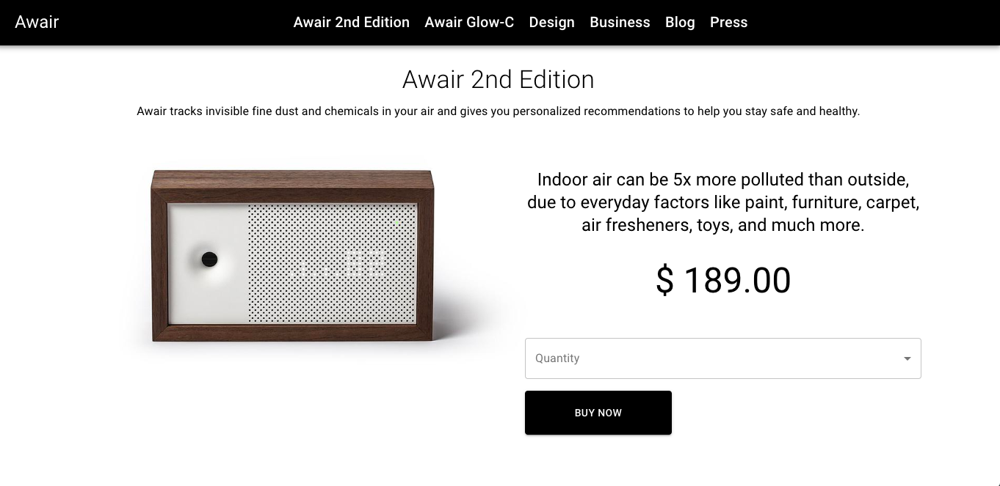

This project was bootstrapped with [Create React App](https://github.com/facebook/create-react-app).

## Clone this repository

git clone <this-repo-clone-link> <give-it-a-name>
cd <give-it-a-name>
npm run start

### `npm install` or `npm i`

Runs the app in the development mode. 
Open [http://localhost:3000](http://localhost:3000) to view it in the browser.

The page will reload if you make edits. 
You will also see any lint errors in the console.

